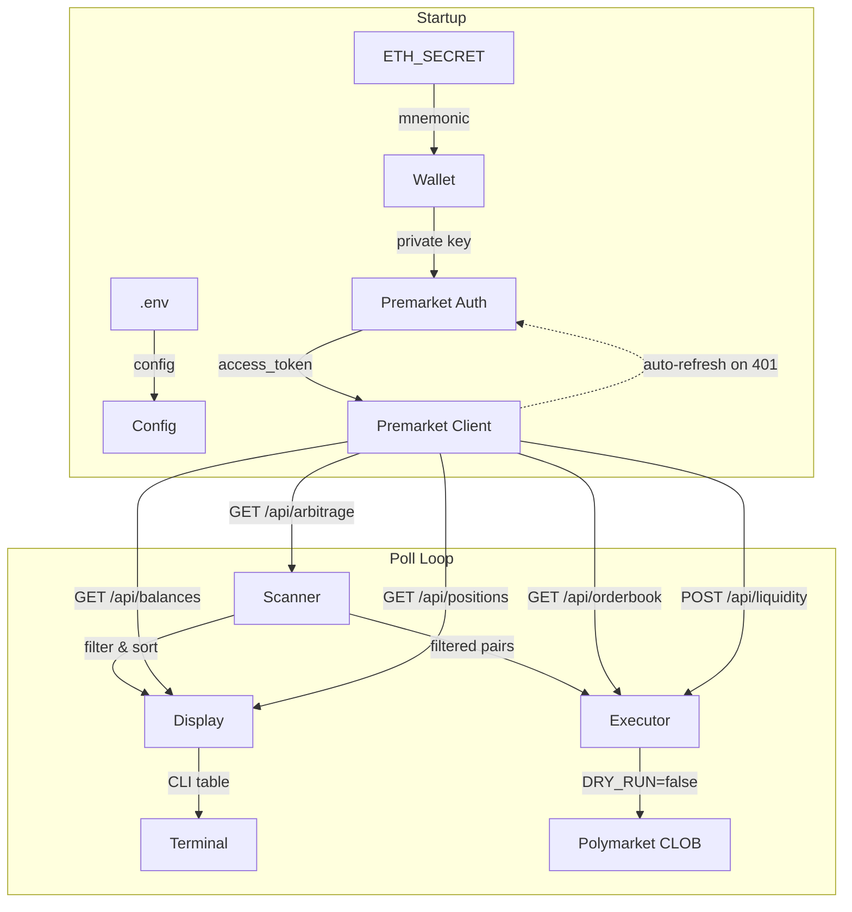

# Архитектура

## Структура проекта

```
w_premarket_arbitrage/
├── .env                      # Секреты и настройки (не коммитится)
├── .env.example              # Шаблон .env
├── .gitignore
├── go.mod / go.sum
├── main.go                   # Точка входа, poll loop, graceful shutdown
│
├── config/
│   └── config.go             # Загрузка .env → struct Config
│
├── wallet/
│   └── wallet.go             # BIP-39 mnemonic → ECDSA private key
│
├── premarket/                # Полный Premarket API клиент
│   ├── client.go             # HTTP client, auto-auth, token refresh
│   ├── auth.go               # Wallet sign-in, refresh, API key
│   ├── orderbook.go          # Кросс-платформенный стакан
│   ├── liquidity.go          # Оптимальный сплит ордера
│   ├── balances.go           # USDC и токен-балансы
│   └── positions.go          # Портфель позиций
│
├── scanner/
│   └── scanner.go            # Обёртка над /api/arbitrage + фильтрация
│
├── display/
│   └── display.go            # CLI-дашборд (lipgloss таблицы)
│
├── executor/
│   └── polymarket.go         # Polymarket CLOB: ордера (dry-run / live)
│
├── docs/                     # Документация
└── temp/                     # Скачанная документация API (не коммитится)
```

## Поток данных



## Модули

### `premarket/client.go` — Центральный API клиент

Единый HTTP-клиент для всех запросов к Premarket API:
- Хранит `accessToken` и `refreshToken`
- **Автоматический retry при 401**: при получении 401 вызывает `doRefresh()` → `reAuthFn()` → повторяет запрос
- Потокобезопасный (`sync.RWMutex`)
- Все модули (scanner, balances, positions) используют один и тот же клиент

### `premarket/auth.go` — Wallet-аутентификация

Авторизация через подпись сообщения приватным ключом (EIP-191 `personal_sign`):

**Формат сообщения** (reverse-engineered из фронтенда Premarket):
```
Welcome to Premarket!

Click to sign in. This request will not trigger a blockchain transaction or cost any gas fees.

Wallet: 0x1f512378f7559dd0581ef343fa0f7244f382d5af
```

> **ВАЖНО**: адрес кошелька должен быть в **нижнем регистре** (`strings.ToLower`).

Методы:
- `SignInWithWallet(privateKey, chainID)` → `POST /api/auth` → access_token + refresh_token
- `CreateAPIKey()` → `POST /api/api-key/generate` → долгоживущий API key

### `premarket/orderbook.go` — Верификация цен

Кросс-платформенный стакан для перепроверки цен перед исполнением:
- `GetOrderbook(params)` → `GET /api/orderbook`
- Поддерживает token ID для всех 6 платформ
- Возвращает asks/bids, best price, combined book

### `premarket/liquidity.go` — Планирование ордера

Оптимальное распределение ордера по платформам:
- `PlanOrderSplit(req)` → `POST /api/liquidity/distribution`
- Учитывает комиссии, мин. размеры ордеров, gas costs
- Возвращает рекомендуемый сплит и среднюю цену исполнения

### `premarket/balances.go` — Балансы

Проверка USDC и market-токенов:
- `GetCashBalances(addresses)` → `GET /api/balances` — USDC по чейнам (Polygon, BSC, Base)
- `GetTokenBalances(addresses, tokenIDs)` → `GET /api/balances/tokens` — балансы market-токенов

### `premarket/positions.go` — Портфель

Мониторинг открытых позиций:
- `GetPositions(addresses)` → `GET /api/positions/aggregated`
- Summary: total_value, active_positions, claimable_value, by_platform, by_chain
- Детали каждой позиции: token_id, source, balance, current_price, value

### `config/config.go`

Загружает все параметры из `.env` через `godotenv`. Обязательный параметр: `ETH_SECRET` (seed phrase от MetaMask). Остальные имеют дефолтные значения.

### `wallet/wallet.go`

Деривирует Ethereum private key из 12-словной BIP-39 мнемоники через HD-кошелёк:
- Путь деривации: `m/44'/60'/0'/0/0` (стандарт MetaMask)
- Верификация: деривированный адрес сравнивается с `ETH_WALLET`
- Библиотека: `go-ethereum-hdwallet`

### `scanner/scanner.go`

Использует `premarket.Client` для запросов:
- Запрос: `GET /api/arbitrage` через shared client
- Парсит JSON в Go-структуры
- Фильтрует по `MinProfitPct`, `MinAPR`, `MinDepthUSD`
- Сортирует по APR по убыванию

### `display/display.go`

CLI-дашборд через `charmbracelet/lipgloss`:
- Таблица с цветовым кодированием (зелёный/жёлтый/красный)
- Показывает топ-25 возможностей
- 💰 USDC баланс кошелька
- 📊 Количество и стоимость открытых позиций
- Индикация режима: 🟢 DRY RUN / 🔴 LIVE TRADING

### `executor/polymarket.go`

Исполнение ордеров на Polymarket:
- В режиме `DRY_RUN=true` — только логирует
- В режиме `DRY_RUN=false` — размещает ордера через CLOB API
- Проверяет ликвидность перед исполнением
- Ограничивает размер сделки через `MAX_TRADE_USD`

### `main.go`

Оркестрация:
1. Загрузка конфига
2. Деривация кошелька
3. **Автоматическая auth через wallet signature**
4. Инициализация scanner через shared Premarket client
5. Poll loop: scan → fetch balances → fetch positions → display → execute
6. Graceful shutdown по `SIGINT` / `SIGTERM`

## Зависимости

| Пакет | Версия | Назначение |
|-------|--------|------------|
| `github.com/joho/godotenv` | v1.5 | Загрузка .env |
| `github.com/charmbracelet/lipgloss` | v1.1 | CLI-стилизация |
| `github.com/miguelmota/go-ethereum-hdwallet` | v0.1.3 | HD wallet derivation |
| `github.com/ethereum/go-ethereum` | v1.17 | Crypto primitives |
