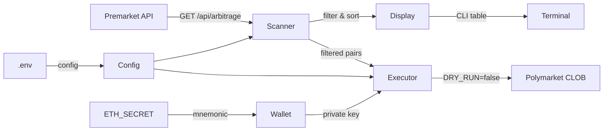

# Архитектура

## Структура проекта

```
w_premarket_arbitrage/
├── .env                      # Секреты и настройки (не коммитится)
├── .env.example              # Шаблон .env
├── .gitignore
├── go.mod / go.sum
├── main.go                   # Точка входа, poll loop, graceful shutdown
│
├── config/
│   └── config.go             # Загрузка .env → struct Config
│
├── wallet/
│   └── wallet.go             # BIP-39 mnemonic → ECDSA private key
│
├── scanner/
│   └── scanner.go            # HTTP-клиент Premarket API + фильтрация
│
├── display/
│   └── display.go            # CLI-дашборд (lipgloss таблицы)
│
├── executor/
│   └── polymarket.go         # Polymarket CLOB: ордера (dry-run / live)
│
└── docs/                     # Документация
```

## Поток данных



## Модули

### `config/config.go`

Загружает все параметры из `.env` через `godotenv`. Каждый параметр имеет дефолтное значение — бот запускается даже с минимальным `.env` (только `PREMARKET_API_KEY`).

### `wallet/wallet.go`

Деривирует Ethereum private key из 12-словной BIP-39 мнемоники через HD-кошелёк:
- Путь деривации: `m/44'/60'/0'/0/0` (стандарт MetaMask)
- Верификация: деривированный адрес сравнивается с `ETH_WALLET`
- Библиотека: `go-ethereum-hdwallet`

### `scanner/scanner.go`

HTTP-клиент для Premarket API:
- Запрос: `GET https://api.premarket.me/api/arbitrage`
- Авторизация: `Bearer <PREMARKET_API_KEY>`
- Парсит JSON в Go-структуры (`ArbitragePair`, `PlatformData`, `ArbitrageData`, `DepthData`)
- Фильтрует по `MinProfitPct`, `MinAPR`, `MinDepthUSD`
- Сортирует по APR по убыванию

### `display/display.go`

CLI-дашборд через `charmbracelet/lipgloss`:
- Таблица с цветовым кодированием (зелёный/жёлтый/красный)
- Показывает топ-25 возможностей
- Индикация режима: 🟢 DRY RUN / 🔴 LIVE TRADING
- Легенда платформ

### `executor/polymarket.go`

Исполнение ордеров на Polymarket:
- В режиме `DRY_RUN=true` — только логирует что бы сделал
- В режиме `DRY_RUN=false` — размещает ордера через CLOB API (TODO: EIP-712)
- Проверяет ликвидность перед исполнением
- Ограничивает размер сделки через `MAX_TRADE_USD`

### `main.go`

Оркестрация:
1. Загрузка конфига
2. Деривация кошелька
3. Poll loop с интервалом `POLL_INTERVAL` секунд
4. Graceful shutdown по `SIGINT` / `SIGTERM` (Ctrl+C)

## Зависимости

| Пакет | Версия | Назначение |
|-------|--------|------------|
| `github.com/joho/godotenv` | v1.5 | Загрузка .env |
| `github.com/charmbracelet/lipgloss` | v1.1 | CLI-стилизация |
| `github.com/miguelmota/go-ethereum-hdwallet` | v0.1.3 | HD wallet derivation |
| `github.com/ethereum/go-ethereum` | v1.17 | Crypto primitives |
