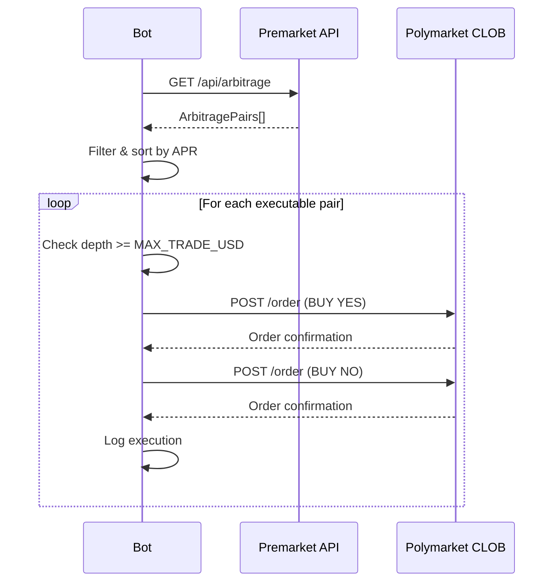

# Polymarket Execution

Автоматическое исполнение арбитражных ордеров на Polymarket через CLOB API.

> **Статус**: DRY_RUN режим реализован. Live execution — TODO.

## Архитектура Polymarket

```
Wallet (EOA) → EIP-712 Signature → CLOB API → Matching Engine → Polygon Settlement
```

### Два уровня аутентификации

**L1 — Wallet Signature (EIP-712)**
- Подписываем typed data приватным ключом
- Получаем API credentials (apiKey, apiSecret, apiPassphrase)
- Одноразовая операция

**L2 — HMAC Authentication**
- Каждый торговый запрос подписывается HMAC
- Используются credentials из L1
- Headers: `POLY-API-KEY`, `POLY-SIGNATURE`, `POLY-TIMESTAMP`, `POLY-PASSPHRASE`

## Wallet Setup

### Тип кошелька: EOA (MetaMask)

```go
// signature_type = 0 для EOA
client := ClobClient{
    Host:          "https://clob.polymarket.com",
    Key:           privateKey,
    ChainID:       137, // Polygon
    SignatureType: 0,   // EOA
}
```

### Деривация ключа из seed phrase

```go
// m/44'/60'/0'/0/0 — стандартный путь MetaMask
wallet, _ := hdwallet.NewFromMnemonic(mnemonic)
path := hdwallet.MustParseDerivationPath("m/44'/60'/0'/0/0")
account, _ := wallet.Derive(path, false)
privateKey, _ := wallet.PrivateKey(account)
```

## Prerequistes для торговли

1. **USDC на Polygon** — нужен баланс для ордеров
2. **Approve контрактов** — разрешить Polymarket тратить USDC
3. **API credentials** — деривируются из wallet signature

## CLOB API Endpoints

| Endpoint | Method | Description |
|----------|--------|-------------|
| `/auth/api-key` | POST | Создать/деривировать API credentials |
| `/order` | POST | Разместить ордер |
| `/order` | DELETE | Отменить ордер |
| `/orders` | GET | Список активных ордеров |
| `/trades` | GET | История сделок |
| `/book` | GET | Order book |

### Размещение ордера

```json
POST /order
{
  "tokenID": "12345...6789",
  "price": 0.50,
  "size": 10,
  "side": "BUY",
  "type": "GTC"
}
```

## Go SDK (community)

| SDK | URL |
|-----|-----|
| polymarket-go-sdk | [github.com/GoPolymarket/polymarket-go-sdk](https://github.com/GoPolymarket/polymarket-go-sdk) |
| Polymarket-golang | [github.com/0xNetuser/Polymarket-golang](https://github.com/0xNetuser/Polymarket-golang) |
| go-clob-client | [github.com/nijaru/go-clob-client](https://github.com/nijaru/go-clob-client) |

## Flow исполнения арбитража



## Текущие ограничения

- **Только Polymarket**: автоматическое исполнение возможно только на Polymarket. Для Kalshi нужен отдельный аккаунт.
- **Односторонний арбитраж**: если одна сторона на Kalshi/Predict.fun — нужно исполнять вручную.
- **Нет cancel logic**: если один ордер исполнился, а второй нет — позиция не захеджирована.
