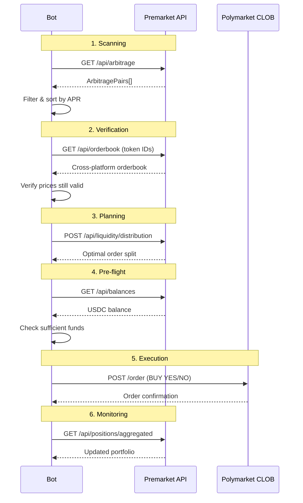

# Polymarket Execution

Автоматическое исполнение арбитражных ордеров на Polymarket через CLOB API.

> **Статус**: DRY_RUN режим реализован. Live execution — TODO.

## Архитектура Polymarket

```
Wallet (EOA) → EIP-712 Signature → CLOB API → Matching Engine → Polygon Settlement
```

### Два уровня аутентификации

**L1 — Wallet Signature (EIP-712)**
- Подписываем typed data приватным ключом
- Получаем API credentials (apiKey, apiSecret, apiPassphrase)

**L2 — HMAC Authentication**
- Каждый торговый запрос подписывается HMAC
- Headers: `POLY-API-KEY`, `POLY-SIGNATURE`, `POLY-TIMESTAMP`, `POLY-PASSPHRASE`

## Premarket API в execution pipeline

В текущей архитектуре бот максимально использует Premarket API:



## Go SDK для Polymarket (community)

| SDK | URL |
|-----|-----|
| polymarket-go-sdk | [github.com/GoPolymarket/polymarket-go-sdk](https://github.com/GoPolymarket/polymarket-go-sdk) |
| Polymarket-golang | [github.com/0xNetuser/Polymarket-golang](https://github.com/0xNetuser/Polymarket-golang) |
| go-clob-client | [github.com/nijaru/go-clob-client](https://github.com/nijaru/go-clob-client) |

## CLOB API Endpoints

| Endpoint | Method | Description |
|----------|--------|-------------|
| `/auth/api-key` | POST | Создать API credentials |
| `/order` | POST | Разместить ордер |
| `/order` | DELETE | Отменить ордер |
| `/orders` | GET | Активные ордера |
| `/trades` | GET | История сделок |
| `/book` | GET | Order book |

### Размещение ордера

```json
POST https://clob.polymarket.com/order
{
  "tokenID": "12345...6789",
  "price": 0.50,
  "size": 10,
  "side": "BUY",
  "type": "GTC"
}
```

## Текущие ограничения

1. **Только Polymarket**: автоматическое исполнение возможно только на Polymarket
2. **Односторонний арбитраж**: если одна сторона на Kalshi — нужно исполнять вручную
3. **Нет cancel logic**: если один ордер исполнился, а второй нет — позиция не захеджирована
4. **Kalshi**: требует KYC + US-only, нет публичного торгового API для ботов
